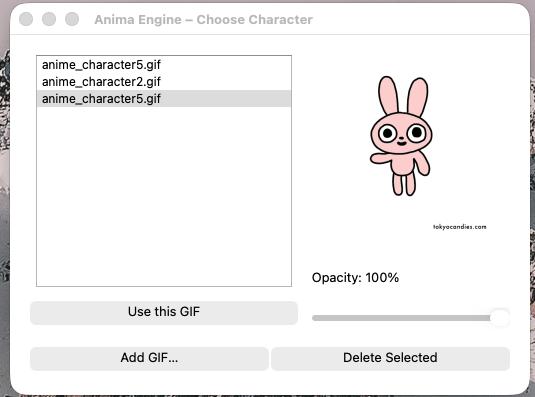

# 🐾 Anima Engine  
### A Desktop Anime Pet Engine — PyQt5 Powered, Customizable, Multi-Pet, and System-Tray Enabled.

Anima Engine is a lightweight desktop companion application built with **Python + PyQt5** that lets you place cute, animated **GIF pets** anywhere on your screen.  
Drag them, lock them, change their characters, spawn multiple pets, import your own GIFs, and enjoy a fully customizable experience.

---

## ✨ Features

### 🐱 Desktop Anime Pets  
- Up to **3 animated pets** at the same time  
- Always stays **on top of all windows**  
- Smooth drag & drop movement  
- **Double-click** to lock/unlock  
- Right-click menu with actions

### 🎨 Character & GIF Management  
- Built-in character GIFs  
- **Import your own GIFs**  
- Delete GIFs from selection list  
- Live animation preview  
- Switch pets instantly

### 💡 Visual Controls  
- Adjustable **opacity slider** (30%–100%)  
- Optional **idle animation** support (via `idle.gif`)  
- Startup fade-in animation  
- Transparent, borderless UI

### 💾 State Persistence  
Automatically saves:  
- Last selected character  
- Window opacity  
- Main pet position  

Loads everything back on next launch.

### 🧰 System Tray Integration  
App keeps running even when the UI is closed.  
Tray menu includes:  
- Show  
- Hide  
- Quit Anima Engine  

---

## 📸 Screenshots

> Add your own screenshots inside `screenshots/` folder for these to work.

Example:



---

## 📦 Installation

### Requirements
- Python **3.8+**
- PyQt5  
  Install using:

```bash
pip install pyqt5
```
---
▶️ Running the App
```bash
python anima_engine.py
```
---
🗂 Project Structure
```
Anima-Engine/
│
├── src/
│   └── anima_engine.py
│
├── gifs/
│   ├── anime_character1.gif
│   ├── anime_character2.gif
│   └── ...
│
├── screenshots/
│   └── preview.png
│
├── README.md
├── LICENSE
└── anima_config.json        # auto-created, stores user settings
```
---
🤖 Tech Stack
- Python 3
- PyQt5
- QMovie, QWidget, QMenu, System Tray
- JSON persistence
---
🔮 Future Features (Planned)
- Click-through mode
- Floating/wandering pets
- Mood system / speech bubbles
- Installer (.exe / .app)
- GIF packs / themes
---
📄 License
This project is licensed under the MIT License.
--
👨‍💻 Author
Tushar Gaudara
If you like this project, ⭐ star the repository!


